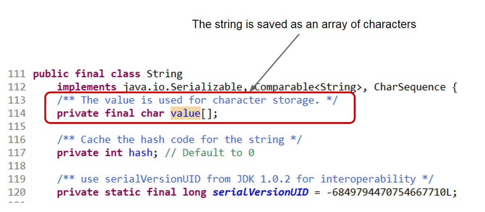

In Java, `String`s ([Java Doc](http://docs.oracle.com/javase/7/docs/api/java/lang/String.html)) are immutable objects as documented in the class Java Doc

> Strings are constant; their values cannot be changed after they are created ([reference](http://docs.oracle.com/javase/7/docs/api/java/lang/String.html))

Therefore, once a `String` is created, it cannot be modified.  Yet, Java provides means for modifying strings without creating new instances as shown in this article.  Java also provides means to safeguard against such things and protect the code from malicious intentions.  By modifying strings we are breaking their contract and thus such action is discouraged.

All code listed below is available at: [https://github.com/javacreed/how-to-modify-a-string-without-creating-a-new-one](https://github.com/javacreed/how-to-modify-a-string-without-creating-a-new-one).  Most of the examples will not contain the whole code and may omit fragments which are not relevant to the example being discussed. The readers can download or view all code from the above link.

This article was inspired by a [video](http://vimeo.com/117411144) posted by Heinz Kabutz ([Homepage](http://www.javaspecialists.eu/)) few days ago.  The readers are encouraged to watch this video.

## Modify a String Instance

Before we see how to modify a `String` we need to understand how the `String` object save its value.  The `String`s were designed to be immutable, thus their values will not change.  The `String` class makes use of a character (primitive type) array to store its value as shown in the following image.



The array is created when the `String` object is instantiated and this is never modified.  Arrays provide high access speed and are the perfect data structure for situations where the length is known beforehand and when resizing is not required.

Arrays in Java are mutable and Java does not provide or support read-only arrays.  Therefore, if we can access the field `value`, within the `String` class, then we can also modify the `String` content.  Furthermore, we can replace the array with yet another array and thus have a completely different string value.  This can be achieved with reflection.

In Java, classes, methods and fields (also known as properties) are _first class objects_.  As defined in _Structure and Interpretation of Computer Programs_ by Gerald Jay Sussman and Harry Abelson ([reference](http://mitpress.mit.edu/sicp/full-text/book/book-Z-H-12.html#call%5Ffootnote%5FTemp%5F121)), a first class element is an element such that it can be

1. Saved into variable
1. Passed as argument to methods
1. Returned as the result of methods
1. Included in data structures (as fields in classes, collections and arrays)

Java has objects that represents classes, methods and fields and these are: `Class` ([Java Doc](http://docs.oracle.com/javase/7/docs/api/java/lang/Class.html)),  `Method` ([Java Doc](http://docs.oracle.com/javase/7/docs/api/java/lang/reflect/Method.html)) and `Field` ([Java Doc](http://docs.oracle.com/javase/7/docs/api/java/lang/reflect/Field.html)) respectively.  Therefore we can access the `String`'s field named `value` and modify it outside the `String` class by accessing the `Field` object.

Java supports reflection, which can be used to get access to the `String`'s `value` field as shown in the following example.

```java
package com.javacreed.examples.lang;

import java.lang.reflect.Field;

public class Example1 {

  public static void main(final String[] args) throws Exception {
    final String s = "Immutable String";
    PrintUtils.print(s);

    final Class<String> type = String.class;
    final Field valueField = type.getDeclaredField("value");
    valueField.setAccessible(true);

    final char[] value = (char[]) valueField.get(s);
    value[0] = 'i';
    value[10] = 's';
    PrintUtils.print(s);

    System.arraycopy("Mutable String".toCharArray(), 0, value, 0, 14);
    PrintUtils.print(s);

    valueField.set(s, "Mutable String".toCharArray());
    PrintUtils.print(s);
  }
}
```

In the above example, we are doing several things.  Let us break this example into smaller fragments and describe each part.

1. An instance of type `String` is created and saved into the variable named `s`.

    ```java
        final String s = "Immutable String";
        PrintUtils.print(s);
    ```

    This variable is then printed using a utilities class created for this article.  The `print()` method prints the object     identity hash code ([Java Doc](http://docs.oracle.com/javase/7/docs/api/java/lang/System.html#identityHashCode(java.lang.Object))), which is 32 bit integer value, followed by the `String` value.  The `String` value is enclosed between the greater than and lower than brackets to mark the start and end of the `String` value.  This was done so that any leading or trailing spaces do not go unnoticed.  

    Following is an example of such output.

    ```
    (Object: 366712642) >Immutable String<
    ```

    Please note that the numeric value representing the object's hash code may change between runs.

1. Next, we retrieved the class object of the `String` class.  This object is of type `Class`, which supports generics.
    ```java
        final Class<String> type = String.class;
    ```

    From the object's class, we can then obtain the methods and fields found in this class as shown next.

    ```java
        final Field valueField = type.getDeclaredField("value");
    ```

    Here we accessed the field by its name.  The method `getDeclaredField()` will either return the `Field` with the given name or throws a `NoSuchFieldException` ([Java Doc](http://docs.oracle.com/javase/7/docs/api/java/lang/NoSuchFieldException.html)) if such field does not exists.  Please note that this method is case sensitive and thus the fields name must match including the case.

    Finally we set the field's accessibility to `true` so that we can access the field.  Note that the `String`'s field `value` has the access modifier set to `private`, therefore we cannot access it from another class.  By setting the field's accessibility to `true`, we can access and modify its value using reflection.

    ```java
        valueField.setAccessible(true);
    ```

    Note that the above code only affects the current instance of the field object and not all instance of the field objects for the same field.  That is, by setting this value to `true` we are only modifying the current field instance and not all instance of this field.

1. Once we have access to the field object we can get the value it holds (or points to).

    ```java
        final char[] value = (char[]) valueField.get(s);
    ```

    In the above fragment we are retrieved in the `String`'s value character array for the `String` object created before.  Our array `value` points to the same object in the heap as the `String`'s field.  In other words, the `String`'s field value has escaped through reflection and we can modify it outside of the `String` object as shown next

    ```java
        value[0] = 'i';
        value[10] = 's';
        PrintUtils.print(s);
    ```

    In the above fragment we are changing the uppercase letters to lowercase and print the value.

    ```
    (Object: 366712642) >immutable string<
    ```

    Note that the printed `String` is all lowercase while the object identity hash-code is still the same.  Here we managed to modify the `String` value without creating a new `String` object.

1. Our experiment goes further.  Next we try to change the `String`'s content to `"Mutable String"` as shown next.

    ```java
        System.arraycopy("Mutable String".toCharArray(), 0, value, 0, 14);
        PrintUtils.print(s);
    ```

    Note that the new string is a bit shorter and thus it does not completely replace the previous value as shown next.

    ```
    (Object: 366712642) >Mutable Stringng<
    ```

    Furthermore, this approach of changing the String's value is a bit dangerous as if the new length is larger than the current `String` length, an exception of type `ArrayIndexOutOfBoundsException` ([Java Doc](http://docs.oracle.com/javase/7/docs/api/java/lang/ArrayIndexOutOfBoundsException.html)) will be thrown as shown next.

    ```
    Exception in thread "main" java.lang.ArrayIndexOutOfBoundsException
    	at java.lang.System.arraycopy(Native Method)
    	at com.javacreed.examples.lang.Example1.main(Example1.java:19)
    ```

    We discourage such approach and prefer the following one for completely modifying the `String`'s value.

1. Similar to the `get()` method, the `Field` class has the `set()` method which replaces the value of this field for the given object to the new value.

    ```java
        valueField.set(s, "Mutable String".toCharArray());
        PrintUtils.print(s);
    ```

    Here we are replacing the value's object (array of characters) with a totally new object.  Notice that now, the `String` object only contains the values we want.

    ```
    (Object: 366712642) >Mutable String<
    ```

As shown and described in the above example, we can modify the `String`'s value without having to create a new `String` object.  This is quite an interesting concept which applies to any object and not just strings.  **With that said, this approach breaks any object oriented principle especially encapsulation as we are able to access fields despite these are set to `private`.  Furthermore this has security implications as we can access and modify sensitive information bypassing any validations applied through methods**.  Please do not take this as a language weakness as Java provides fine grain security mechanisms which prevents this as we will see in the next section.

For completeness, please find following the `PrintUtils` class.

```java
package com.javacreed.examples.lang;

public class PrintUtils {

  private PrintUtils() {}

  public static void print(String s) {
    System.out.printf("(Object: %d) >%s<%n", System.identityHashCode(s), s);
  }
}
```

## Java Security Manager

Despite from any negative impressions that one may have formed when reading the previous section, Java is a very secure language.  The code that we saw before will fail if a `SecurityManager` ([Java Doc](http://docs.oracle.com/javase/7/docs/api/java/lang/SecurityManager.html) and [Tutorial](http://docs.oracle.com/javase/tutorial/essential/environment/security.html)) is used.  

> A security manager is an object that defines a security policy for an application. This policy specifies actions that are unsafe or sensitive. Any actions not allowed by the security policy cause a `SecurityException` to be thrown. An application can also query its security manager to discover which actions are allowed. ([reference](http://docs.oracle.com/javase/tutorial/essential/environment/security.html))

Using a security manager we can control what methods can be invoked and fail with a `SecurityException` ([Java Doc](http://docs.oracle.com/javase/7/docs/api/java/lang/SecurityException.html)) if such methods are invoked in a manner which is not permitted by our security policy.  The following example shows how to enable the security manager for our example.

```java
package com.javacreed.examples.lang;

import java.lang.reflect.Field;

public class Example2 {
  public static void main(final String[] args) throws Exception {
    /* java -Djava.security.manager */
    System.setSecurityManager(new SecurityManager());

    final Class<String> type = String.class;
    /* The following line fails with an AccessControlException exception */
    final Field valueField = type.getDeclaredField("value");
    valueField.setAccessible(true);
  }
}
```

After setting a security manager, the above code will fail with an `AccessControlException` ([Java Doc](http://docs.oracle.com/javase/7/docs/api/java/security/AccessControlException.html)) exception as shown next.

```
Exception in thread "main" java.security.AccessControlException: access denied ("java.lang.RuntimePermission" "accessDeclaredMembers")
	at java.security.AccessControlContext.checkPermission(AccessControlContext.java:457)
	at java.security.AccessController.checkPermission(AccessController.java:884)
	at java.lang.SecurityManager.checkPermission(SecurityManager.java:549)
	at java.lang.Class.checkMemberAccess(Class.java:2335)
	at java.lang.Class.getDeclaredField(Class.java:2054)
	at com.javacreed.examples.lang.Example2.main(Example2.java:12)
```

The default security manager does not allow us to access the `String`'s field `value` and thus protects the rest of the system from malicious code.  What if we need to make an exception?  In the next section we will see how to use a security manager and still allows access to the `String`'s field value.

The security manager can be defined as a command line argument as shown in the following example.

```
java -Djava.security.manager
```

Furthermore, the security manager can also prevent that the it is replaced at runtime.  In other words, it protects against code that tries to disable it.

## Making Exceptions

The security manager can be customised to provide very fine grain security checks.  We will not go through any depth about what the security manager can do in this article.  On the contrary, we will simply skim the very surface and show how the security managed can be extended to allow access to the `String`'s `value` field.

```java
package com.javacreed.examples.lang;

import java.lang.reflect.Field;
import java.security.Permission;
import java.util.Arrays;

public class Example3 {
  public static void main(final String[] args) throws Exception {
    System.setSecurityManager(new SecurityManager() {
      @Override
      public void checkPermission(final Permission perm) {
        switch (perm.getName()) {
        /* Allows getDeclaredField() */
        case "accessDeclaredMembers":
        /* Allows setAccessible() */
        case "suppressAccessChecks":
        /* Allows formatting and printing */
        case "user.language.format":
        case "user.script.format":
        case "user.country.format":
        case "user.variant.format":
        case "java.locale.providers":
          /* Ignore/Allow */
          break;
        default:
          super.checkPermission(perm);
        }
      }
    });

    final Class<String> type = String.class;
    final Field valueField = type.getDeclaredField("value");
    valueField.setAccessible(true);

    final String s = "Immutable String";
    PrintUtils.print(s);
    final char[] value = (char[]) valueField.get(s);
    value[0] = 'i';
    value[10] = 's';
    PrintUtils.print(s);

    Arrays.fill(value, (char) 0);
    System.arraycopy("Mutable String".toCharArray(), 0, value, 0, 14);
    PrintUtils.print(s);

    valueField.set(s, "Mutable String".toCharArray());
    PrintUtils.print(s);
  }
}
```

In the above example we extended the `SecurityManager` on-the-fly and created an inner anonymous class ([Tutorial](http://docs.oracle.com/javase/tutorial/java/javaOO/anonymousclasses.html)) which override the method `checkPermission()`, shown next.

```java
    System.setSecurityManager(new SecurityManager() {
      @Override
      public void checkPermission(final Permission perm) {
        switch (perm.getName()) {
        /* Allows getDeclaredField() */
        case "accessDeclaredMembers":
        /* Allows setAccessible() */
        case "suppressAccessChecks":
        /* Allows formatting and printing */
        case "user.language.format":
        case "user.script.format":
        case "user.country.format":
        case "user.variant.format":
        case "java.locale.providers":
          /* Ignore/Allow */
          break;
        default:
          super.checkPermission(perm);
        }
      }
    });
```

In this trivial example, we are accepting anything which action name (defined by `Permission.getName()` method, [Java Doc](http://docs.oracle.com/javase/7/docs/api/java/security/Permission.html#getName())) matches the list provided above.  Any other checks, are delegated to the original security manager.

As one can see from the number of exception that we had to add, through the security manager we can control almost anything and fail if something is not as we expect it to be.  The security manager provides a great deal of fine grained security and provides a sound fence for untrusted code.

## Collateral Damage

While the topic discussed here may seem attractive, it has some collateral damage which may produce undesired results.  Java makes use of string pool and all string literals always refer to the same instance as described in the Java Language Specification ([reference](http://docs.oracle.com/javase/specs/jls/se7/html/jls-3.html#jls-3.10.5)).

> Moreover, a string literal always refers to the same instance of class `String`. This is because string literals - or, more generally, strings that are the values of constant expressions ([§15.28](http://docs.oracle.com/javase/specs/jls/se7/html/jls-15.html#jls-15.28)) - are "_interned_" so as to share unique instances, using the method `String.intern`. ([reference](http://docs.oracle.com/javase/specs/jls/se7/html/jls-3.html#jls-3.10.5))

Therefore, modifying one `String` literal will affect all literals of the same string.  Consider the following example.

```java
package com.javacreed.examples.lang;

import java.lang.reflect.Field;

public class Example4 {

  public static void main(final String[] args) throws Exception {
    final Class<String> type = String.class;
    final Field valueField = type.getDeclaredField("value");
    valueField.setAccessible(true);

    final String s = "Immutable String";
    valueField.set(s, "Mutable String".toCharArray());

    System.out.println("Immutable String");

    final String o = "Immutable String";
    System.out.println(o);
  }
}
```

What will the above code print?  Unfortunately it prints the modified string, despite we are printing the string literal as shown next.

```
Mutable String
Mutable String
```

This change affects all code that is running on the same JVM.  While one may like the idea of modifying `String`s without creating a new instance, this is highly discouraged.  Java provides specific classes that support mutable strings and these should be used instead of this approach.

## Conclusion

The Java API provides two variants of mutable string, `StringBuilder` ([Java Doc](http://docs.oracle.com/javase/7/docs/api/java/lang/StringBuilder.html)) and `StringBuffer` ([Java Doc](http://docs.oracle.com/javase/7/docs/api/java/lang/StringBuffer.html)).  These classes can be safely modified without breaking any object oriented principles.  The `StringBuilder` is not thread safe and should be preferred when thread safety is not a concern.  The `StringBuffer` provides thread-safety but it is a bit slower than the `StringBuilder`.  Changing something that should not be changed may be fun, but can have far reaching effects.  Such changes are propagated throughout the JVM since string literals are cached and reused.  Security managers should be used with sensitive applications to make sure that developers do not, intentionally or unintentionally, execute code which should not be executed.
